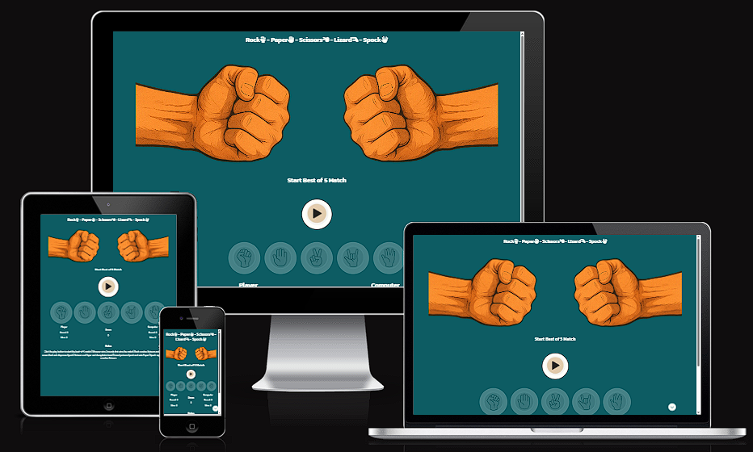
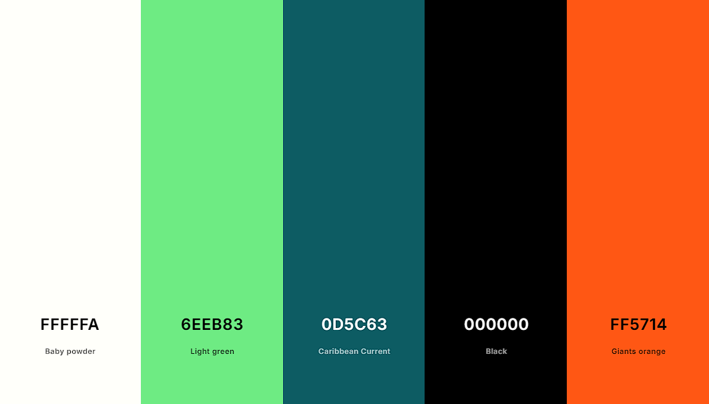

# Rock, Paper, Scissors Browser Game
## **Site Overview**
"Rock, Paper, Scissors, Lizard, Spock" is a fun and fully responsive browser game adaptation of the extended Rock, Paper, Scissors game made famous by “The Big Bang Theory”. This version adds Lizard and Spock to the mix, increasing the complexity and fun!

## Table of contents:
1. [**Site Overview**](#site-overview)
2. [**Planning stage**](#planning-stage)
    * [***Target Audiences***](#target-audiences)
    * [***User Stories***](#user-stories)
    * [***Site Aims***](#site-aims)
    * [***How This Will Be Accomplished***](#how-this-will-be-accomplished)
    * [***Wireframes***](#wireframes)
    * [***Color Scheme***](#color-scheme)
3. [**Features**](#features)
    * [***Typography***](#typography)
4. [**Game Rules**](#game-rules)

5. [**Future Improvements**](#future-improvements)
6. [**Testing Phase**](#testing-phase)
7. [**Deployment**](#deployment)
8. [**Credits**](#credits)
    * [***General reference***](#general-reference)
    * [***Technologies used***](#technologies-used)
    * [***Content***](#content)
    * [***Media***](#media)

## **Planning stage**
### **Target Audiences:**

* Users looking for a fun, entertaining browser version of the classic ‘rock-paper-scissors’ game with extended rules.
* Fans of The Big Bang Theory series, which made this version of the game famous.

### **User Stories:**

* As a user, I want to be able to select the five options (Rock, Paper, Scissors, Lizard, Spock) with a click.
* As a user, I want to see immediately what the computer has selected.
* As a user, I want to receive clear feedback on who has won the round and why ("Spock smashes scissors!").
* As a user, I want to be able to track my score over several rounds.
* As a fan of The Big Bang Theory series, I would like to recognise the original rules and design elements (e.g., Spock's symbol).

### **Site Aims:**

* To fully implement the rules of the game with 5 options.
* To give feedback in real time after each round (result + score)
* To provide an intuitive user interface with large buttons and a clear display of the results

### **How This Will Be Accomplished:**

* By using HTML for the structure of the game interface, CSS for styling and JavaScript for the game logic and DOM manipulations.
* By showing the user high-quality buttons and images of the game elements.
* By clearly informing the user whether they have won or lost the round via an alert.
* By displaying the current score to the user via a counter.

### **Wireframes:**
I created wireframes for this project to organise my ideas and not lose focus. See the links below for the mobile and desktop versions of the four wireframes.

* Mobile Wireframes:
[Home page](docs/wireframes/rpsls_wireframe_mobile.png)

* Desktop wireframes:
[Home page](docs/wireframes/rpsls_wireframe_desktop.png)

Although the structure outlined in the original wireframes was largely preserved, several changes became necessary during the course of the project to ensure a functional and visually appealing experience for players across all screen sizes:

* Instead of using a single combined graphic as initially planned, two separate graphics were implemented. This decision was based on the fact that splitting the visuals into player and computer hand gestures only required 5 different images. A single combined graphic would have required 25 image variants. Additionally, this approach proved beneficial for the JavaScript logic, making it easier to later introduce a special fallback graphic for the player when no gesture is selected in time.
* During development, it became clear that placing the scoreboard at the top of the screen would take up too much space and distract from the game visuals and controls — including the hand gesture graphics, the play button/timer, and the gesture choice buttons. As a result, the scoreboard was moved below the main game area.
* The initially planned combined display of the countdown timer and the win/loss message above the game graphics was split into two separate components:
    * The timer was merged into the play button. Once the play button is clicked, a 5-second countdown replaces it.
    * The win/loss messages are now shown via pop-up alerts using SweetAlert2.
* As the project progressed and testing was conducted, it became apparent that the game rules should be explained directly on the page. Therefore, a footer section was added where all rules are clearly listed and accessible to users at any time.

These changes explain why the final project differs in certain aspects from the originally created wireframes.

* Mobile:
[Home page](docs/screenshots/mobile-view.png)

* Desktop:
[Home page](docs/screenshots/desktop-view.png)

### **Color Scheme:**
When selecting the color scheme, I aimed for a clean and clear palette with dark and soft tones that would enhance the focus on the game graphics.
To create the color palette, I used https://coolors.co.
I chose a shade of green as the background color, a white variant for the text and button backgrounds, and a light green as a highlight color for the buttons.
Additionally, I used an orange variation for the game countdown background and black for the countdown number itself to create a sense of urgency.

## **Features**
* Play **Best of Five** matches against the computer.
* Choose between five gestures within a countdown of 5 seconds.
* If you don’t choose in time, the computer automatically wins the round.
* Visual feedback and round results are shown using **SweetAlert2**.
* Scoreboard updates dynamically after each round.

## **Typography**
* One font is used throughout the page:
    * Kanit for all text content and headings.

## **Game Rules**
The rules are based on the expanded version:
* **Rock** crushes Scissors and crushes Lizard.
* **Paper** covers Rock and disproves Spock.
* **Scissors** cut Paper and decapitate Lizard.
* **Lizard** eats Paper and poisons Spock.
* **Spock** smashes Scissors and vaporizes Rock.

***
## **Future Improvements**
* Add sound effects for interactions and wins/losses.
* Track match history or personal high scores.
* Possibility to enter the name of the player and to personalise the scoreboard.
* Implement a multiplayer mode (Player vs. Player).

***
## **Testing Phase**
I have documented the testing processes, both during and after development, in a separate file named [TESTING.md](TESTING.md).

***
## **Deployment**
I deployed the page on GitHub Pages via the following procedure:

1. From the project's [repository](https://github.com/ksstrat/milestone-project-2), go to the **Settings** tab.
2. From the left-hand menu, select the **Pages** tab.
3. Under the **Source** section, select the **Main** branch from the drop-down menu and click **Save**.
4. A message will be displayed to indicate a successful deployment to GitHub pages and provide the live link.

You can find the live site via the following URL: [Rock, Paper, Scissors, Lizard, Spock](https://ksstrat.github.io/milestone-project-2/)
***
## **Credits**

### **General reference:**

### **Technologies used:**

### **Content:**

### **Media:**
