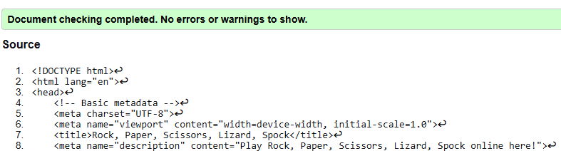
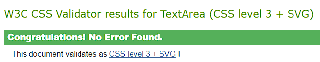
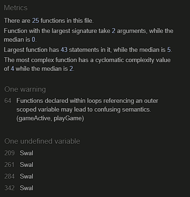
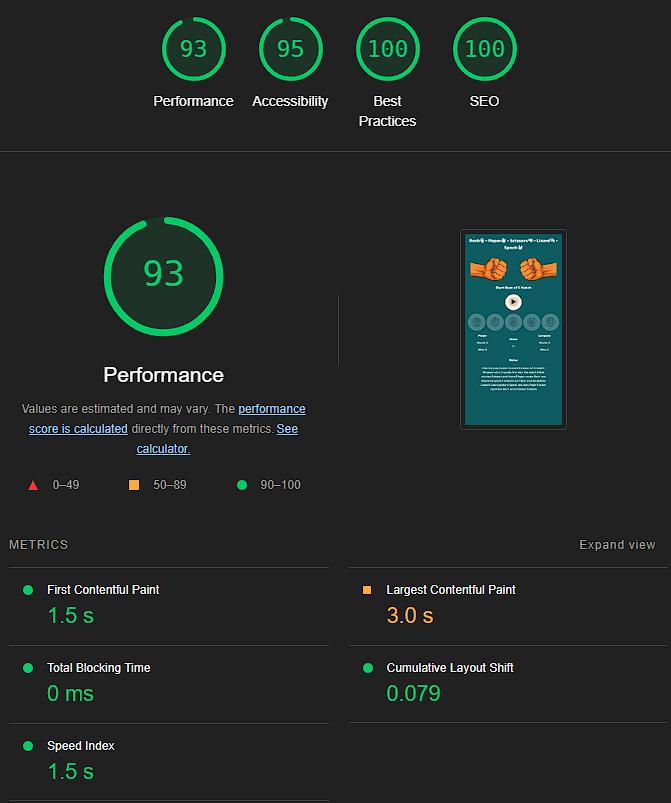
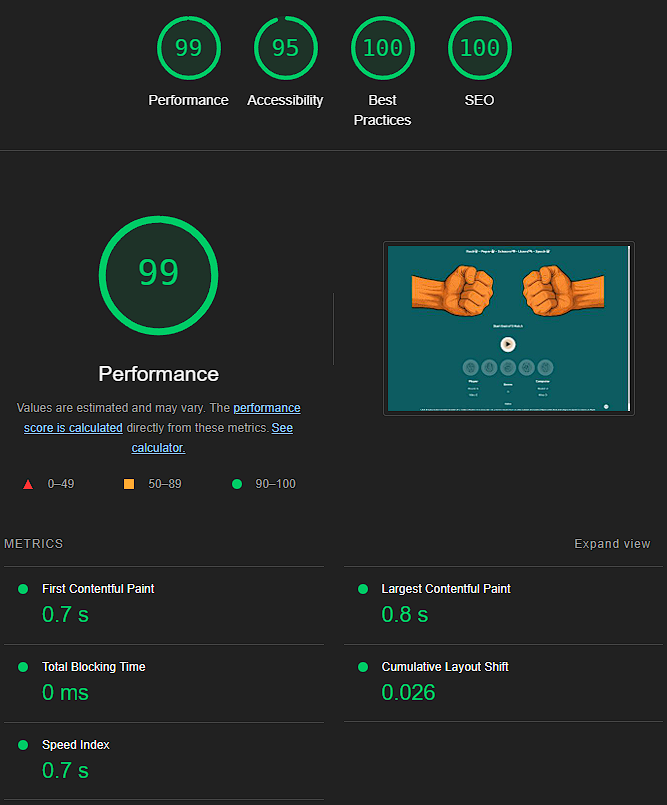

## Table of Contents
* [**Testing During Development**](#testing-during-development)
    * [*Manual Testing*](#manual-testing)
    * [*Bugs and Fixes*](#bugs-and-fixes)
* [**Post Development Testing**](#post-development-testing)
  * [**Validators**](#validators)
      * [*HTML*](#html)
      * [*CSS*](#css)
      * [*JShint*](#jshint)
  * [**Lighthouse Scores**](#lighthouse-scores)
      * [*Desktop Testing*](#desktop-testing)
      * [*Mobile Testing*](#mobile-testing)

## **Testing During Development**
While developing, I've manually tested using the following methods:

1. I manually tested each element for appearance and responsiveness by using a VSCode extension called 'Live Server' to start a local server and then testing my project mainly in the Chrome browser.
    
2. I published the page using GitHub Pages and shared the link with friends, including many developers, to test and get feedback.

### ***Manual Testing:***
* To ensure cross-compatibility, I tested the project on four different browsers. The desktop browsers I utilized included:

  1. Chrome
  2. Firefox  
  3. Vivaldi
  4. Safari

* I have always carried out the manual testing with particular attention to the user stories defined in the README.md. This ensures that a user has the best possible experience with the website.
* I utilized the browser's developer tools to simulate various screen sizes and devices, ranging from mobile (320 px in width) to Ultra Wide Screens (4000 px in width)." 
* I also asked several people with different android and iphone mobile phones to test the site as well.

### ***Bugs and Fixes:***

During the development process, I identified the following bugs through manual testing:

1.  * ***Issue:*** 
        * The styling of the compScore class was not applied correctly.
    * ***Solution:*** 
        * This was due to a typo. Once this was discovered, it was easily fixed. The styling was then applied correctly.

2.  * ***Issue:*** 
        * The game graphic of the ‘Rock’ gesture was not displayed.
    * ***Solution:***
        * Due to a simpler handling of the hand gesture images in the javascript logic, the images were renamed, but the path was not updated accordingly. It was easy to fix.

3.  * ***Issue:*** 
        * It was no longer possible to click on the play button to start the game.
    * ***Solution:***
        * After a change in the script.js code, the click events were broken. This was caused by a missing semicolon. Using JShint, the problem was quickly found and fixed. This occurred several times, especially after changes to the SweetAlert2 pop-up logic.

4.  * ***Issue:*** 
        * The computer's hand gesture did not change.
    * ***Solution:***
        * randomChoice function returned a string instead of an index. Once the problem was discovered, it was quickly fixed.

5.  * ***Issue:*** 
        * The game could be started over and over again before a round was finished.
    * ***Solution:***
        * The playerHasChosen flag was missing from the playGame function. Setting it to true fixed the problem.

6.  * ***Issue:*** 
        * There was an error in the ruleset. The SweetAlert message showed "unknown" as the winning condition.
    * ***Solution:***
        * There was a transposed number in the assignments of the const messages variable.

7.  * ***Issue:*** 
        * The game closed while the timer was still running if you quickly clicked away from the SweetAlert2 pop-up.
    * ***Solution:***
        * The call to the endGame function has been removed from the playGame function and placed at the end of the Swal.Fire call. This solved the problem.

8.  * ***Issue:*** 
        * After a draw, if you quickly clicked away from the SweetAlert2 pop-up, the timer would continue to run after the game ended.
    * ***Solution:***
        * The call to the endGame function was missing in the displayAlert function for draw rounds.

9.  * ***Issue:*** 
        * The computer's match win counter was not updated after a Bo5 win.
    * ***Solution:***
        * When the logic was created, only compWin.text was written instead of compWin.textContent. After removing this typo, the counter worked as intended.

## **Post Development Testing**
### **Validators**

#### ***HTML*** 
- https://validator.w3.org/
***

#### ***index.html***

* No error or warning was found during the validation of index.html.

### ***CSS*** 
- https://jigsaw.w3.org/css-validator/
***

#### ***style.css***

* No error or warning was found during the validation of style.css

### ***JShint*** 
- https://jshint.com/
***

* JSHint warns: “Functions declared within loops referencing [...]” - However, since this function follows the structure used in the JavaScript lessons and the behavior is predictable and stable in this context, I have decided to keep the implementation as is. The warning has no impact on the game's functionality or the website's overall behavior.

* The warning about the undefined variable is due to using SweetAlert2 via CDN rather than installing it locally. Since the library is successfully loaded at runtime, this has no effect on functionality and can safely be ignored.

### **Lighthouse Scores**
***
### **Test conditions**
* All of the Lighthouse tests were run in the Chrome browser using the developer tools in incognito mode.
* Both desktop and mobile tests were conducted.
 
### ***index.html***

* The Lighthouse scores for both mobile and desktops regarding "Performance", "Accessibility", "Best Practices" and "SEO" are 100 or close to 100 across all pages.
* There is no need for action here, as scores above 90 is considered good and save by Google in terms of user experience.

***Mobile Testing:***
***

***Desktop Testing:***
***

***

[return to README.md](README.md)